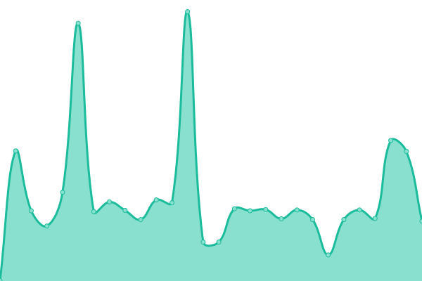
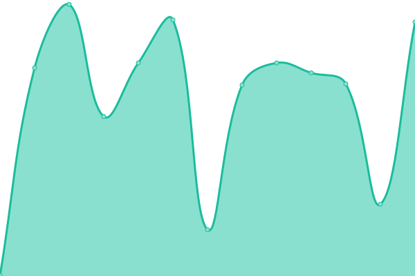

# [📈 Live Status](https://demo.upptime.js.org): <!--live status--> **🟩 All systems operational**

This repository contains the open-source uptime monitor and status page for [Upptime](https://upptime.js.org), powered by [Upptime](https://github.com/upptime/upptime).

With [Upptime](https://upptime.js.org), you can get your own unlimited and free uptime monitor and status page, powered entirely by a GitHub repository. We use [Issues](https://github.com/upptime/upptime/issues) as incident reports, [Actions](https://github.com/trytry123-ops/TuataraStatusPage/actions) as uptime monitors, and [Pages](https://demo.upptime.js.org) for the status page.

<!--start: status pages-->
<!-- This summary is generated by Upptime (https://github.com/upptime/upptime) -->
<!-- Do not edit this manually, your changes will be overwritten -->
<!-- prettier-ignore -->
| URL | Status | History | Response Time | Uptime |
| --- | ------ | ------- | ------------- | ------ |
|  Action.bot | 🟩 Up | [action-bot.yml](https://github.com/trytry123-ops/TuataraStatusPage/commits/HEAD/history/action-bot.yml) | 

 1111ms
     
 | 

<a href="https://trytry123-ops.github.io/TuataraStatusPage/history/action-bot">0.00%</a>
    

|  [Tuatara.pl](https://tuatara.pl/) | 🟩 Up | [tuatara-pl.yml](https://github.com/trytry123-ops/TuataraStatusPage/commits/HEAD/history/tuatara-pl.yml) | 

 966ms
     
 | 

<a href="https://trytry123-ops.github.io/TuataraStatusPage/history/tuatara-pl">100.00%</a>
    

|  [pepper](https://www.pepper.pl/nowe) | 🟩 Up | [pepper.yml](https://github.com/trytry123-ops/TuataraStatusPage/commits/HEAD/history/pepper.yml) | 

 833ms
     
 | 

<a href="https://trytry123-ops.github.io/TuataraStatusPage/history/pepper">100.00%</a>
    

|  [Wikipedia](https://en.wikipedia.org) | 🟩 Up | [wikipedia.yml](https://github.com/trytry123-ops/TuataraStatusPage/commits/HEAD/history/wikipedia.yml) | 

 215ms
     
 | 

<a href="https://trytry123-ops.github.io/TuataraStatusPage/history/wikipedia">100.00%</a>
    

|  [Hacker News2](https://news.ycombinator.com) | 🟩 Up | [hacker-news2.yml](https://github.com/trytry123-ops/TuataraStatusPage/commits/HEAD/history/hacker-news2.yml) | 

 348ms
     
 | 

<a href="https://trytry123-ops.github.io/TuataraStatusPage/history/hacker-news2">100.00%</a>
    

<!--end: status pages-->

[**Visit our status website →**](https://demo.upptime.js.org)

## 📄 License

- Powered by: [Upptime](https://github.com/upptime/upptime)
- Code: [MIT](./LICENSE) © [Anand Chowdhary](https://anandchowdhary.com), supported by [Pabio](https://pabio.com)
- Data in the `./history` directory: [Open Database License](https://opendatacommons.org/licenses/odbl/1-0/)
